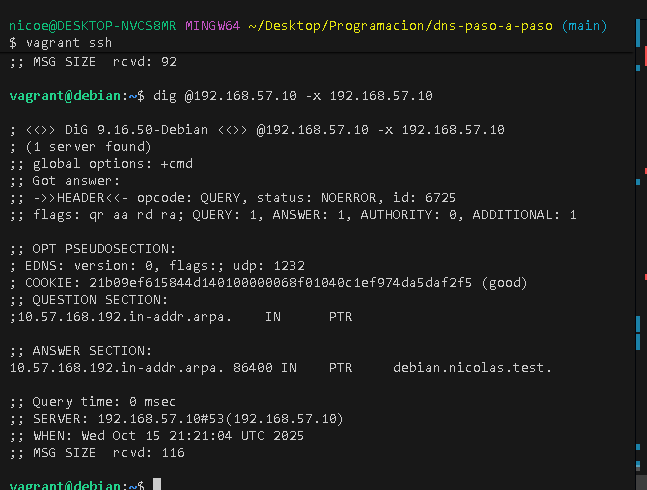

# Configuración del Servidor DNS

**Autor:** Nicolás Esteban Lopez Novoa
**Curso:** Desarrollo De Aplicaciones Web 2 Año 
**Zona DNS:** nicolas.test  
**Red:** 192.168.57.0/24  
**IP Servidor:** 192.168.57.10

---

## Tabla de Contenidos
1. [Preparación del Entorno](#1-preparación-del-entorno)
2. [Instalación de BIND9](#2-instalación-de-bind9)
3. [Configuración del Servidor](#3-configuración-del-servidor)
4. [Configuración de Zonas](#4-configuración-de-zonas)
5. [Verificación](#5-verificación)
6. [Pruebas de Funcionamiento](#6-pruebas-de-funcionamiento)
7. [Cuestiones Finales](#7-cuestiones-finales)

---

## 1. Preparación del Entorno

### 1.1 Estructura del Proyecto
Se creó la estructura de directorios:
```
dns-paso-a-paso/
├── README.md
├── Vagrantfile
├── bootstrap.sh
├── .gitignore
├── config/
│   ├── named
│   ├── named.conf.options
│   ├── named.conf.local
│   ├── nicolas.test.dns
│   └── nicolas.test.rev
└── doc/
    ├── README.md
    └── images/
```

### 1.2 Repositorio Git
Se inicializó el repositorio git y se conectó con GitHub:
```bash
git init
git remote add origin https://github.com/usuario/dns-paso-a-paso.git
```

### 1.3 Configuración de Vagrant
Se configuró una máquina virtual con:
- Sistema operativo: Debian Bullseye
- IP: 192.168.57.10
- Hostname: debian
- Memoria: 1024 MB

---

## 2. Instalación de BIND9

### 2.1 Paquetes Instalados
Se instalaron los siguientes paquetes:
```bash
apt-get install -y bind9 bind9utils bind9-doc dnsutils
```

**Descripción de paquetes:**
- `bind9`: Servidor DNS
- `bind9utils`: Utilidades para administración
- `bind9-doc`: Documentación
- `dnsutils`: Herramientas de consulta (dig, nslookup)

### 2.2 Configuración IPv4
Se modificó `/etc/default/named` para que BIND solo use IPv4:
```bash
OPTIONS="-u bind -4"
```

---

## 3. Configuración del Servidor

### 3.1 Archivo named.conf.options

Se configuró una ACL (Access Control List) para permitir consultas recursivas solo desde nuestra red:

```
acl confiables {
    192.168.57.0/24;
};

options {
    directory "/var/cache/bind";
    allow-transfer { none; };
    listen-on port 53 { 192.168.57.10; };
    recursion yes;
    allow-recursion { confiables; };
    dnssec-validation yes;
};
```

### 3.2 Verificación de la configuracion
```bash
named-checkconf /etc/bind/named.conf.options
```

---

## 4. Configuración de Zonas

### 4.1 Declaración de Zonas (named.conf.local)

Se declararon dos zonas en `/etc/bind/named.conf.local`:

```
zone "nicolas.test" {
    type master;
    file "/var/lib/bind/nicolas.test.dns";
};

zone "57.168.192.in-addr.arpa" {
    type master;
    file "/var/lib/bind/nicolas.test.rev";
};
```

### 4.2 Zona de Resolución Directa

Archivo: `/var/lib/bind/nicolas.test.dns`

```
$TTL 86400
@       IN      SOA     debian.nicolas.test. admin.nicolas.test. (
                        2024101501      ; Serial
                        3600            ; Refresh
                        1800            ; Retry
                        604800          ; Expire
                        86400 )         ; Negative Cache TTL
;
@       IN      NS      debian.nicolas.test.
debian.nicolas.test.    IN      A       192.168.57.10
```

**Registros configurados:**
- `SOA`: Start of Authority, define el servidor autoritativo
- `NS`: Name Server, indica el servidor DNS de la zona
- `A`: Address, mapea el nombre a una dirección IPv4

### 4.3 Zona de Resolución Inversa

Archivo: `/var/lib/bind/nicolas.test.rev`

```
$TTL 86400
@       IN      SOA     debian.nicolas.test. admin.nicolas.test. (
                        2024101501      ; Serial
                        3600            ; Refresh
                        1800            ; Retry
                        604800          ; Expire
                        86400 )         ; Negative Cache TTL
;
@       IN      NS      debian.nicolas.test.
10      IN      PTR     debian.nicolas.test.
```

**Registro PTR:**
- Mapea la IP 192.168.57.10 al nombre debian.nicolas.test

### 4.4 Verificación de Zonas

```bash
# Verificar zona directa
named-checkzone nicolas.test /var/lib/bind/nicolas.test.dns

# Verificar zona inversa
named-checkzone 57.168.192.in-addr.arpa /var/lib/bind/nicolas.test.rev
```

---

## 5. Verificación

### 5.1 Reinicio del Servicio
```bash
systemctl restart named
systemctl status named
```

### 5.2 Verificación de Logs
En los logs del sistema se debe ver:
```
zone 57.168.192.in-addr.arpa/IN: loaded serial 2024101501
zone nicolas.test/IN: loaded serial 2024101501
```

---

## 6. Pruebas de Funcionamiento

### 6.1 Prueba con dig

**Consulta directa:**
```bash
dig @192.168.57.10 debian.nicolas.test
```

**Resultado esperado:**
```
;; ANSWER SECTION:
debian.nicolas.test. 86400 IN A 192.168.57.10
```

Mi resultado:


**Consulta inversa:**
```bash
dig @192.168.57.10 -x 192.168.57.10
```
Mi resultado:


### 6.2 Prueba con nslookup

**Resultado esperado:**
```
Server:     192.168.57.10
Address:    192.168.57.10#53

Name:   debian.nicolas.test
Address: 192.168.57.10
```

Mi resultado:


---

## 7. Cuestiones Finales

### 7.1 ¿Qué pasará si un cliente de una red diferente intenta usar el DNS?

No le funcionará. Un cliente de otra red no podrá hacer consultas recursivas a nuestro servidor DNS porque está configurado para permitir consultas recursivas solo a la red 192.168.57.0/24, definida en la ACL "confiables".

Esto se puede ver en la configuración de `named.conf.options`:
```
acl confiables {
    192.168.57.0/24;
};
...
allow-recursion { confiables; };
```


### 7.2 ¿Por qué tenemos que permitir las consultas recursivas?

Son necesarias cuando nuestro servidor DNS recibe una petición de un dominio del cual no es autoritativo. En ese caso, el servidor tiene que:

1. Consultar a otros servidores DNS
2. Seguir las referencias hasta obtener la respuesta
3. Devolver la respuesta al cliente

Sin recursión, el servidor solo podría responder consultas sobre zonas de las que es autoritativo (como nicolas.test en mi caso), pero no podría resolver nombres como "google.com" o cualquier otro dominio externo.

### 7.3 ¿El servidor DNS es autoritativo? ¿Por qué?

Sí, el servidor DNS es autoritativo para la zona "nicolas.test" y para la zona inversa "57.168.192.in-addr.arpa".

Es autoritativo porque:
1. Se declaró como `type master` en la configuración
2. Contiene los archivos de zona originales
3. Es la fuente de información oficial para esos dominios
4. Tiene el registro SOA (Start of Authority) que lo identifica como autoritativo

### 7.4 ¿Dónde encontramos la directiva $ORIGIN y para qué sirve?

El `$ORIGIN` se puede encontrar en los archivos de zona DNS (archivos .dns y .rev).

**Función:** Define el dominio base para los nombres relativos en el archivo de zona. Si no se especifica directamente, `$ORIGIN` toma el valor del nombre de zona especificado en `named.conf.local`.

En este caso:
- Para `nicolas.test.dns`: $ORIGIN es `nicolas.test.`
- Para `nicolas.test.rev`: $ORIGIN es `57.168.192.in-addr.arpa.`

### 7.5 ¿Una zona es idéntico a un dominio?

**No son idénticos, aunque tienen algo de relacion.** 

**Un dominio:** Es un nombre en el espacio de nombres DNS (ejemplo: nicolas.test, google.com)

**Una zona:** Es una porción del espacio de nombres DNS que está bajo control de un servidor DNS específico, Esta contiene:
- Los archivos de configuración
- Los registros DNS
- La información autoritativa de uno o más dominios

**Diferencias:**
- Un dominio puede estar dividido en múltiples zonas
- Una zona puede contener múltiples dominios

**Por ejemplo:** El dominio `empresa.com` podría tener:
- Zona principal: `empresa.com`
- Subzona delegada: `ventas.empresa.com` (gestionada por otro servidor DNS)

asi que se podria decir que el dominio es el nombre, y la zona es la "base de datos" que dice que hacer con ese nombre.

### 7.6 ¿Cuántos servidores raíz existen?

Existen **13 servidores raíz** con letras de la A a la M:
- a.root-servers.net
- b.root-servers.net
- c.root-servers.net
- ... hasta ...
- m.root-servers.net

**Dato importante:** Aunque son 13 "nombres", cada uno está implementado mediante múltiples servidres físicos distribuidos en sitios diferentes usando Anycast. En total hay cientos de servidores físicos, pero se presentan como 13 direcciones IP.

### 7.7 ¿Qué es una consulta iterativa de referencia?

Una consulta iterativa (o no recursiva) es aquella en la que el servidor DNS responde con:
- La mejor información que tiene en ese momento, O
- Una referencia a otro servidor DNS que podría tener la respuesta

**Proceso:**
1. Cliente pregunta a servidor local por `www.google.com`
2. Servidor local no tiene la respuesta
3. Servidor local pregunta al root server (consulta iterativa)
4. Root server responde: "No sé, pero pregunta al servidor de .com"
5. Servidor local pregunta al servidor de .com (consulta iterativa)
6. Servidor de .com responde: "No sé, pero pregunta al servidor de google.com"
7. Servidor local pregunta al servidor de google.com
8. Este responde con la IP de www.google.com
9. Servidor local devuelve la respuesta al cliente original

**Diferencia con consulta recursiva:**
- **Recursiva:** El servidor hace todo el trabajo y devuelve la respuesta final
- **Iterativa:** El servidor devuelve referencias y el cliente debe hacer las consultas una tras otra para llegar a la respuesta

### 7.8 En una resolución inversa, ¿a qué nombre se mapearía la IP 172.16.34.56?

En una resolución inversa, la IP 172.16.34.56 se mapearía al nombre de zona:

**`56.34.16.172.in-addr.arpa`**

**Porque:**
1. Se toma la dirección IP: 172.16.34.56
2. Se invierte el orden de los octetos: 56.34.16.172
3. Se añade el: `.in-addr.arpa`

El archivo de zona inversa correspondiente sería `34.16.172.in-addr.arpa` (para toda la red 172.16.34.0/24), y dentro de ese archivo habría un registro:

```
56  IN  PTR  nombre-del-host.dominio.com.
```

